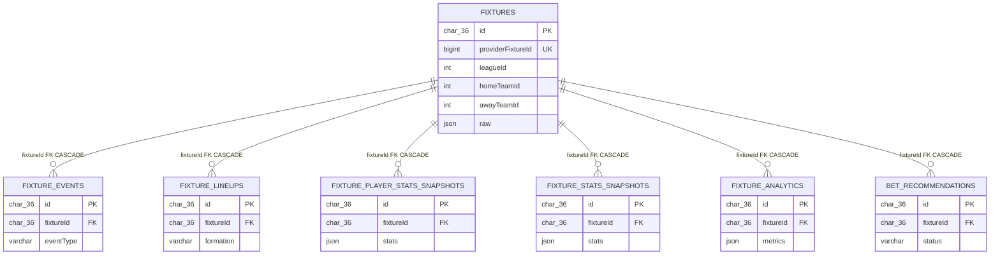

# Schéma de données — api-score

Document de référence généré à partir de :
- `src/database/entities/*.entity.ts` (16 entités)
- `src/database/migrations/*.ts` (15 migrations, source de vérité du SQL réellement appliqué)

`synchronize` est désactivé (voir `data-source.ts`) : le schéma réel est celui produit par les migrations, pas nécessairement celui que laissent supposer les décorateurs TypeORM des entités.

---

## Vue d'ensemble par domaine

| Domaine | Entités |
|---|---|
| Monitoring / ops | `ApiUsageLog`, `AppRuntimeState` |
| Référentiel géo-compétition & championnats | `Country`, `League`, `Team`, `Match`, `Standing` |
| Fixtures & ingestion live | `Fixture`, `FixtureEvent`, `FixtureLineup`, `FixturePlayerStatsSnapshot`, `FixtureStatsSnapshot`, `ApiFootballPayload` |
| Analytics | `FixtureAnalytics` |
| Recommandations & coupons | `BetRecommendation`, `SmartCoupon` |

---

## Monitoring / ops

### `api_usage_logs`
Journal de chaque appel sortant vers un provider externe (API-Football), avec latence et statut.

| Colonne | Type SQL | Nullable | Défaut | Note |
|---|---|---|---|---|
| `id` | char(36) | non | — | PK |
| `provider` | varchar(100) | non | — | |
| `endpoint` | varchar(255) | non | — | |
| `requestParams` | json | oui | — | |
| `responseStatus` | int | non | — | |
| `latencyMs` | int | non | — | |
| `rateLimitRemaining` | int | oui | — | |
| `calledAt` | datetime | non (voir incohérence) | CURRENT_TIMESTAMP | |
| `createdAt` | datetime | non | CURRENT_TIMESTAMP | |
| `updatedAt` | datetime | non | CURRENT_TIMESTAMP ON UPDATE CURRENT_TIMESTAMP | |

Index : PK(`id`), KEY `idx_api_usage_logs_called_at`(`calledAt`), KEY `idx_api_usage_logs_endpoint`(`endpoint`).

### `app_runtime_state`
Table clé/valeur générique pour stocker un état runtime applicatif (JSON).

| Colonne | Type SQL | Nullable | Défaut | Note |
|---|---|---|---|---|
| `id` | char(36) | non | — | PK |
| `key` | varchar(120) | non | — | unique |
| `value` | json | non | — | |
| `updatedAt` | datetime | non | CURRENT_TIMESTAMP ON UPDATE CURRENT_TIMESTAMP | |
| `createdAt` | datetime | non | CURRENT_TIMESTAMP | |

Index/contraintes : PK(`id`), UNIQUE `uq_app_runtime_state_key`(`key`).

---

## Référentiel géo-compétition & championnats

### `countries`
Liste des pays référencés par le provider externe.

| Colonne | Type SQL | Nullable | Défaut | Note |
|---|---|---|---|---|
| `id` | char(36) | non | — | PK |
| `countryId` | int | non | — | unique, id externe API-Football |
| `name` | varchar(120) | non | — | |
| `logo` | varchar(255) | oui | — | |
| `createdAt` | datetime | non | CURRENT_TIMESTAMP | |
| `updatedAt` | datetime | non | CURRENT_TIMESTAMP ON UPDATE CURRENT_TIMESTAMP | |

Index : PK(`id`), UNIQUE `idx_country_country_id`(`countryId`).

### `leagues`
Compétitions/championnats référencés par le provider externe.

| Colonne | Type SQL | Nullable | Défaut | Note |
|---|---|---|---|---|
| `id` | char(36) | non | — | PK |
| `leagueId` | int | non | — | unique, id externe API-Football |
| `name` | varchar(200) | non | — | |
| `countryId` | int | oui | — | id externe pays, pas de FK |
| `season` | varchar(20) | oui | — | `int` à l'origine, changé en `varchar(20)` par la migration `20260225130000` |
| `logo` | varchar(255) | oui | — | ajoutée par `20260225130000` |
| `countryName` | varchar(120) | oui | — | ajoutée par `20260225130000` |
| `createdAt` | datetime | non | CURRENT_TIMESTAMP | |
| `updatedAt` | datetime | non | CURRENT_TIMESTAMP ON UPDATE CURRENT_TIMESTAMP | |

Index : PK(`id`), UNIQUE `idx_league_league_id`(`leagueId`).

### `teams`
Équipes référencées par le provider externe (identité + stade).

| Colonne | Type SQL | Nullable | Défaut | Note |
|---|---|---|---|---|
| `id` | char(36) | non | — | PK |
| `teamKey` | int | non | — | unique, id externe API-Football |
| `name` | varchar(120) | non | — | |
| `code` | varchar(20) | oui | — | |
| `country` | varchar(80) | oui | — | |
| `founded` | int | oui | — | |
| `national` | tinyint | oui | — | |
| `badge` | varchar(255) | oui | — | |
| `venueId` | int | oui | — | |
| `venueName` | varchar(160) | oui | — | |
| `venueAddress` | varchar(160) | oui | — | |
| `venueCity` | varchar(120) | oui | — | |
| `venueCapacity` | int | oui | — | |
| `venueSurface` | varchar(40) | oui | — | |
| `venueImage` | varchar(255) | oui | — | |
| `venue` | json | oui | — | copie brute du bloc `venue` du provider |
| `leagueId` | int | oui | — | id externe league, pas de FK |
| `raw` | json | oui | — | payload brut provider |
| `createdAt` | datetime | non | CURRENT_TIMESTAMP | |
| `updatedAt` | datetime | non | CURRENT_TIMESTAMP ON UPDATE CURRENT_TIMESTAMP | |

Index : PK(`id`), UNIQUE `idx_teams_team_key`(`teamKey`), KEY `idx_teams_league_id`(`leagueId`).

### `matches`
Table dédiée à la page "Championnats" (matchs par championnat/saison), distincte de `fixtures` (voir section Relations).

| Colonne | Type SQL | Nullable | Défaut | Note |
|---|---|---|---|---|
| `id` | char(36) | non | — | PK |
| `fixtureId` | int | non | — | unique, id externe API-Football (pas une FK vers `fixtures.id`) |
| `leagueId` | int | oui | — | id externe league |
| `leagueName` | varchar(200) | oui | — | |
| `leagueLogo` | varchar(255) | oui | — | ajoutée par `20260225130000` |
| `countryId` | int | oui | — | ajoutée par `20260225130000` |
| `countryName` | varchar(120) | oui | — | ajoutée par `20260225130000` |
| `countryLogo` | varchar(255) | oui | — | ajoutée par `20260225130000` |
| `homeTeamId` | int | oui | — | ajoutée par `20260225130000` |
| `homeName` | varchar(120) | oui | — | |
| `homeTeamBadge` | varchar(255) | oui | — | ajoutée par `20260225130000` |
| `homeFormation` | varchar(20) | oui | — | ajoutée par `20260225130000` |
| `awayTeamId` | int | oui | — | ajoutée par `20260225130000` |
| `awayName` | varchar(120) | oui | — | |
| `awayTeamBadge` | varchar(255) | oui | — | ajoutée par `20260225130000` |
| `awayFormation` | varchar(20) | oui | — | ajoutée par `20260225130000` |
| `matchDate` | varchar(20) | oui | — | ajoutée par `20260225130000` (à ne pas confondre avec `eventDate`) |
| `matchTime` | varchar(10) | oui | — | ajoutée par `20260225130000` |
| `eventDate` | datetime | oui | — | colonne d'origine |
| `scoreHome` | varchar(10) | oui | — | ajoutée par `20260225130000` |
| `scoreAway` | varchar(10) | oui | — | ajoutée par `20260225130000` |
| `halfTimeScoreHome` | varchar(10) | oui | — | ajoutée par `20260225130000` |
| `halfTimeScoreAway` | varchar(10) | oui | — | ajoutée par `20260225130000` |
| `extraTimeScoreHome` | varchar(10) | oui | — | ajoutée par `20260225130000` |
| `extraTimeScoreAway` | varchar(10) | oui | — | ajoutée par `20260225130000` |
| `penaltyScoreHome` | varchar(10) | oui | — | ajoutée par `20260225130000` |
| `penaltyScoreAway` | varchar(10) | oui | — | ajoutée par `20260225130000` |
| `ftScoreHome` | varchar(10) | oui | — | ajoutée par `20260225130000` |
| `ftScoreAway` | varchar(10) | oui | — | ajoutée par `20260225130000` |
| `status` | varchar(100) | oui | — | |
| `isLive` | tinyint | non | 0 | ajoutée par `20260225130000` |
| `round` | varchar(80) | oui | — | |
| `stageId` | varchar(40) | oui | — | ajoutée par `20260225130000` |
| `stageName` | varchar(120) | oui | — | ajoutée par `20260225130000` |
| `stadium` | varchar(200) | oui | — | ajoutée par `20260225130000` |
| `referee` | varchar(120) | oui | — | ajoutée par `20260225130000` |
| `raw` | json | oui | — | |
| `createdAt` | datetime | non | CURRENT_TIMESTAMP | |
| `updatedAt` | datetime | non | CURRENT_TIMESTAMP ON UPDATE CURRENT_TIMESTAMP | |

Index : PK(`id`), UNIQUE `idx_matches_fixture_id`(`fixtureId`), KEY `idx_matches_league_id`(`leagueId`).

### `standings`
Classement par championnat/saison/équipe.

| Colonne | Type SQL | Nullable | Défaut | Note |
|---|---|---|---|---|
| `id` | char(36) | non | — | PK |
| `leagueId` | int | non | — | id externe league, pas de FK |
| `season` | varchar(20) | oui | — | |
| `teamKey` | int | non | — | id externe équipe |
| `teamName` | varchar(120) | non | — | |
| `teamBadge` | varchar(255) | oui | — | |
| `standingPlace` | int | non | 0 | |
| `standingPlaceType` | varchar(100) | oui | — | |
| `played` / `won` / `drawn` / `lost` | int | non | 0 | |
| `goalsFor` / `goalsAgainst` / `goalDiff` / `points` | int | non | 0 | |
| `homeWon` / `homeDrawn` / `homeLost` / `homeGF` / `homeGA` / `homePoints` | int | oui | — | |
| `awayWon` / `awayDrawn` / `awayLost` / `awayGF` / `awayGA` / `awayPoints` | int | oui | — | |
| `createdAt` | datetime | non | CURRENT_TIMESTAMP | |
| `updatedAt` | datetime | non | CURRENT_TIMESTAMP ON UPDATE CURRENT_TIMESTAMP | |

Index : PK(`id`), UNIQUE `idx_standings_league_team`(`leagueId`, `teamKey`), KEY `idx_standings_league_id`(`leagueId`).

---

## Fixtures & ingestion live

### `fixtures`
Table pivot du pipeline d'ingestion live : une ligne par fixture provider, avec `raw` JSON complet et horodatage de dernière synchro. C'est la seule table de ce domaine référencée par de vraies FK.

| Colonne | Type SQL | Nullable | Défaut | Note |
|---|---|---|---|---|
| `id` | char(36) | non | — | PK, référencé par FK depuis les tables `fixture_*` et `bet_recommendations` |
| `providerFixtureId` | bigint | non | — | unique, id externe API-Football |
| `leagueId` | int | oui | — | id externe league, pas de FK |
| `season` | int | oui | — | |
| `homeTeamId` | int | oui | — | id externe équipe, pas de FK |
| `awayTeamId` | int | oui | — | id externe équipe, pas de FK |
| `homeTeamName` | varchar(120) | oui | — | ajoutée par `20260220123000` |
| `awayTeamName` | varchar(120) | oui | — | ajoutée par `20260220123000` |
| `homeTeamBadge` | varchar(255) | oui | — | ajoutée par `20260220125000` |
| `awayTeamBadge` | varchar(255) | oui | — | ajoutée par `20260220125000` |
| `leagueName` | varchar(120) | oui | — | ajoutée par `20260220123000` |
| `statusShort` | varchar(20) | oui | — | |
| `statusLong` | varchar(120) | oui | — | |
| `elapsed` | int | oui | — | |
| `matchDate` | datetime | oui | — | |
| `scoreHome` | int | oui | — | |
| `scoreAway` | int | oui | — | |
| `raw` | json | non | — | payload brut provider |
| `lastSyncedAt` | datetime | non | CURRENT_TIMESTAMP | |
| `createdAt` | datetime | non | CURRENT_TIMESTAMP | |
| `updatedAt` | datetime | non | CURRENT_TIMESTAMP ON UPDATE CURRENT_TIMESTAMP | |

Index : PK(`id`), UNIQUE `idx_fixtures_provider_fixture_id`(`providerFixtureId`), KEY `idx_fixtures_last_synced_at`(`lastSyncedAt`).

### `fixture_events`
Événements de match (buts, cartons, etc.), un enregistrement par événement.

| Colonne | Type SQL | Nullable | Défaut | Note |
|---|---|---|---|---|
| `id` | char(36) | non | — | PK |
| `fixtureId` | char(36) | non | — | **FK** → `fixtures.id` ON DELETE CASCADE |
| `teamId` | int | oui | — | |
| `playerId` | int | oui | — | |
| `assistPlayerId` | int | oui | — | |
| `minute` | int | oui | — | |
| `extra` | int | oui | — | |
| `eventType` | varchar(60) | oui | — | |
| `detail` | varchar(120) | oui | — | |
| `raw` | json | non | — | |
| `createdAt` | datetime | non | CURRENT_TIMESTAMP | |

Index/contraintes : PK(`id`), KEY `idx_fixture_events_fixture_id`(`fixtureId`), FK `fk_fixture_events_fixture_id`.

### `fixture_lineups`
Snapshot de composition d'équipe pour une fixture.

| Colonne | Type SQL | Nullable | Défaut | Note |
|---|---|---|---|---|
| `id` | char(36) | non | — | PK |
| `fixtureId` | char(36) | non | — | **FK** → `fixtures.id` ON DELETE CASCADE |
| `teamId` | int | oui | — | |
| `formation` | varchar(30) | oui | — | |
| `coach` | json | oui | — | |
| `startXi` | json | oui | — | |
| `substitutes` | json | oui | — | |
| `raw` | json | non | — | |
| `snapshotAt` | datetime | non | CURRENT_TIMESTAMP | |
| `createdAt` | datetime | non | CURRENT_TIMESTAMP | |

Index/contraintes : PK(`id`), KEY `idx_fixture_lineups_fixture_id`(`fixtureId`), FK `fk_fixture_lineups_fixture_id`.

### `fixture_player_stats_snapshots`
Snapshot de stats individuelles par joueur pour une fixture, à un instant donné.

| Colonne | Type SQL | Nullable | Défaut | Note |
|---|---|---|---|---|
| `id` | char(36) | non | — | PK |
| `fixtureId` | char(36) | non | — | **FK** → `fixtures.id` ON DELETE CASCADE |
| `teamId` | int | oui | — | |
| `playerId` | int | oui | — | |
| `stats` | json | non | — | |
| `snapshotAt` | datetime | non | CURRENT_TIMESTAMP | |
| `createdAt` | datetime | non | CURRENT_TIMESTAMP | |

Index/contraintes : PK(`id`), KEY `idx_fixture_player_stats_fixture_id`(`fixtureId`), KEY `idx_fixture_player_stats_snapshot_at`(`snapshotAt`), FK `fk_fixture_player_stats_fixture_id`.

### `fixture_stats_snapshots`
Snapshot de stats d'équipe (par mi-temps) pour une fixture, à un instant donné.

| Colonne | Type SQL | Nullable | Défaut | Note |
|---|---|---|---|---|
| `id` | char(36) | non | — | PK |
| `fixtureId` | char(36) | non | — | **FK** → `fixtures.id` ON DELETE CASCADE |
| `teamId` | int | oui | — | |
| `half` | varchar(20) | oui | — | |
| `elapsed` | int | oui | — | |
| `stats` | json | non | — | |
| `snapshotAt` | datetime | non | CURRENT_TIMESTAMP | |
| `createdAt` | datetime | non | CURRENT_TIMESTAMP | |

Index/contraintes : PK(`id`), KEY `idx_fixture_stats_snapshot_fixture_id`(`fixtureId`), KEY `idx_fixture_stats_snapshot_snapshot_at`(`snapshotAt`), FK `fk_fixture_stats_fixture_id`.

### `api_football_payloads`
Cache brut des réponses provider (payload complet), par endpoint/params.

| Colonne | Type SQL | Nullable | Défaut | Note |
|---|---|---|---|---|
| `id` | char(36) | non | — | PK |
| `provider` | varchar(40) | non | — | |
| `endpoint` | varchar(80) | non | — | |
| `params` | json | non | — | |
| `payload` | json | non | — | |
| `matchId` | varchar(40) | oui | — | id externe, pas de FK |
| `leagueId` | int | oui | — | id externe, pas de FK |
| `teamId` | int | oui | — | id externe, pas de FK |
| `fetchedAt` | datetime | non | CURRENT_TIMESTAMP | |
| `createdAt` | datetime | non | CURRENT_TIMESTAMP | |

Index : PK(`id`), KEY `idx_api_football_payloads_endpoint`(`endpoint`), KEY `idx_api_football_payloads_match_id`(`matchId`), KEY `idx_api_football_payloads_league_id`(`leagueId`), KEY `idx_api_football_payloads_fetched_at`(`fetchedAt`).

---

## Analytics

### `fixture_analytics`
Métriques calculées (agrégats) pour une fixture, recalculées périodiquement.

| Colonne | Type SQL | Nullable | Défaut | Note |
|---|---|---|---|---|
| `id` | char(36) | non | — | PK |
| `fixtureId` | char(36) | non | — | **FK** → `fixtures.id` ON DELETE CASCADE |
| `metrics` | json | non | — | |
| `computedAt` | datetime | non | CURRENT_TIMESTAMP | |
| `createdAt` | datetime | non | CURRENT_TIMESTAMP | |

Index/contraintes : PK(`id`), KEY `idx_fixture_analytics_fixture_id`(`fixtureId`), KEY `idx_fixture_analytics_computed_at`(`computedAt`), FK `fk_fixture_analytics_fixture_id`.

---

## Recommandations & coupons

### `bet_recommendations`
Recommandations de paris générées automatiquement pour une fixture.

| Colonne | Type SQL | Nullable | Défaut | Note |
|---|---|---|---|---|
| `id` | char(36) | non | — | PK |
| `fixtureId` | char(36) | non | — | **FK** → `fixtures.id` ON DELETE CASCADE |
| `marketType` | varchar(120) | non | — | |
| `selection` | varchar(160) | non | — | |
| `currentOdd` | decimal(8,3) | non | — | |
| `minAcceptableOdd` | decimal(8,3) | non | — | |
| `edgePct` | decimal(5,2) | non | — | |
| `confidenceScore` | int | non | — | |
| `reasons` | json | non | — | |
| `riskFlags` | json | non | — | |
| `status` | varchar(20) | non | 'NEW' | `'NEW' \| 'ACTIVE' \| 'REJECTED'` |
| `createdAt` | datetime | non | CURRENT_TIMESTAMP | |
| `updatedAt` | datetime | non | CURRENT_TIMESTAMP ON UPDATE CURRENT_TIMESTAMP | |

Index/contraintes : PK(`id`), KEY `idx_bet_recommendations_fixture_id`(`fixtureId`), KEY `idx_bet_recommendations_status`(`status`), FK `fk_bet_recommendations_fixture_id`.

### `smart_coupons`
Suggestions de paris "live" générées par les règles de détection en cours de match.

| Colonne | Type SQL | Nullable | Défaut | Note |
|---|---|---|---|---|
| `id` | varchar(36) | non | `(UUID())` | PK, générée côté MySQL (les autres tables laissent TypeORM générer l'UUID côté app) |
| `fixtureId` | varchar(36) | non | — | lien logique vers `fixtures.id`, **pas de FK déclarée** |
| `homeTeamName` | varchar(120) | oui | — | |
| `awayTeamName` | varchar(120) | oui | — | |
| `teamId` | int | oui | — | id externe équipe concernée |
| `teamName` | varchar(120) | oui | — | |
| `isHomeTeam` | tinyint(1) | non | 0 | |
| `marketType` | varchar(80) | non | — | |
| `selection` | varchar(255) | non | — | |
| `currentOdd` | decimal(6,2) | oui | — | |
| `minAcceptableOdd` | decimal(6,2) | oui | — | |
| `edgePct` | decimal(5,2) | oui | — | |
| `confidenceScore` | int | oui | — | |
| `reasons` | json | oui | — | |
| `ruleName` | varchar(80) | oui | — | |
| `elapsedAtSuggestion` | int | oui | — | |
| `shotsCount` | int | oui | — | |
| `status` | varchar(10) | non | 'PENDING' | `'PENDING' \| 'WON' \| 'LOST'` |
| `resolvedAt` | datetime | oui | — | |
| `createdAt` | datetime | non | CURRENT_TIMESTAMP | |
| `updatedAt` | datetime | non | CURRENT_TIMESTAMP ON UPDATE CURRENT_TIMESTAMP | |

Index : PK(`id`), INDEX `idx_smart_coupons_fixture_team_market`(`fixtureId`, `teamId`, `marketType`) — non unique, INDEX `idx_smart_coupons_status`(`status`).

---

## Relations

### Vraies clés étrangères (FK SQL déclarées)

Seule la famille "fixtures" possède des FK réelles, toutes vers `fixtures.id`, toutes en `ON DELETE CASCADE` :

- `fixture_events.fixtureId` → `fixtures.id`
- `fixture_lineups.fixtureId` → `fixtures.id`
- `fixture_player_stats_snapshots.fixtureId` → `fixtures.id`
- `fixture_stats_snapshots.fixtureId` → `fixtures.id`
- `fixture_analytics.fixtureId` → `fixtures.id`
- `bet_recommendations.fixtureId` → `fixtures.id`

### Liens logiques uniquement (pas de contrainte FK en base)

Toutes les autres relations ne sont que des conventions de nommage (id externe API-Football ou id interne), sans contrainte FK déclarée en migration ni relation TypeORM :

- `smart_coupons.fixtureId` → `fixtures.id` (commentaire d'intention dans l'entité, mais aucune FK, aucun `@ManyToOne`)
- `teams.leagueId` → `leagues.leagueId` (id externe, pas `leagues.id`)
- `matches.leagueId` → `leagues.leagueId`
- `matches.countryId` → `countries.countryId`
- `matches.homeTeamId` / `matches.awayTeamId` → id externe équipe (pas de lien déclaré vers `teams.teamKey`)
- `standings.leagueId` → `leagues.leagueId`
- `standings.teamKey` → `teams.teamKey`
- `league.countryId` → `countries.countryId`
- `fixtures.leagueId` → `leagues.leagueId`
- `fixtures.homeTeamId` / `fixtures.awayTeamId` → id externe équipe
- `api_football_payloads.matchId` / `leagueId` / `teamId` → ids externes (aucun lien)

`matches` et `fixtures` sont deux tables parallèles et non liées entre elles : `matches` sert la page "Championnats" (identifiée par l'id externe API-Football en `int`), `fixtures` sert le pipeline d'ingestion live (identifiée par un `id` UUID interne, avec `providerFixtureId` en `bigint` comme référence externe).

### Diagramme ER (FK réelles uniquement)

Les tables `countries`, `leagues`, `teams`, `matches`, `standings`, `smart_coupons`, `api_football_payloads`, `api_usage_logs`, `app_runtime_state` ne figurent pas dans ce diagramme : elles ne sont reliées à aucune autre table par une contrainte FK.

---

## Incohérences constatées

1. **`api_usage_logs.calledAt` — migration de fix ciblant la mauvaise colonne.** La migration `20260212173000-init-lot1-monitoring-tables.ts` crée la colonne `calledAt` (camelCase) en `datetime NOT NULL DEFAULT CURRENT_TIMESTAMP`. La migration ultérieure `20260611000001-fix-api-usage-log-called-at.ts` exécute `ALTER TABLE api_usage_logs MODIFY called_at datetime NULL` — en `snake_case`, une colonne qui n'existe pas dans le schéma (`called_at` ≠ `calledAt`). Si cette migration a été exécutée, elle a dû échouer avec `Unknown column 'called_at'`. Par ailleurs l'entité `ApiUsageLog` déclare `calledAt: Date | null` (nullable), ce qui correspond à l'intention de cette migration mais pas à l'état réel de la colonne en base si celle-ci n'a jamais été appliquée avec succès (elle resterait `NOT NULL`).

2. **`smart_coupons.fixtureId` sans FK ni relation TypeORM**, contrairement à toutes les autres tables `*_fixtureId` du domaine "fixtures" qui ont une vraie FK `ON DELETE CASCADE`. Le commentaire dans l'entité ("Référence vers la fixture (fixtures.id, UUID)") documente une intention de lien qui n'est pas appliquée au niveau base de données — une suppression de fixture ne supprime/n'affecte pas les coupons associés.

3. **Type de colonne PK divergent pour `smart_coupons.id`** : `VARCHAR(36) NOT NULL DEFAULT (UUID())` (génération côté MySQL), alors que toutes les autres tables utilisent `char(36)` avec génération d'UUID côté application via `@PrimaryGeneratedColumn('uuid')` de TypeORM (pas de valeur `DEFAULT` SQL). Fonctionnellement équivalent mais convention différente.

4. **Déclaration de type TypeORM incohérente pour une même colonne "FK logique vers fixtures.id"** entre entités : `bet_recommendations.fixtureId` est déclarée `@Column({ type: 'char', length: 36 })` alors que `fixture_analytics.fixtureId` est déclarée `@Column({ type: 'uuid' })`. Les deux produisent un `char(36)` en MySQL, mais la convention diffère.

5. **`matches` et `fixtures` sont deux modèles de données quasi-redondants** (mêmes informations : scores, équipes, badges, stade, arbitre, statut live) mais totalement indépendants : aucune FK, aucune clé commune formalisée entre les deux tables. `matches.fixtureId` est un `int` (id externe API-Football), alors que `fixtures.id` est un `char(36)` (UUID interne) et `fixtures.providerFixtureId` est un `bigint`. Rien ne garantit qu'un même match provider soit représenté de façon cohérente dans les deux tables.
